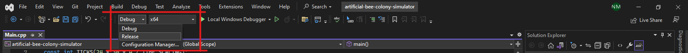
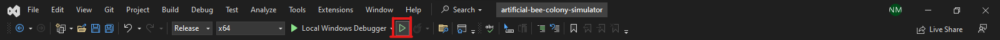

# artificial-bee-colony-simulator

You could see the paper that utilizes this program [here](documents/13570-paper.pdf) and the certificate that we were awarded [here](documents/13570-certificate.pdf).

## Getting Started

1. Install and open Visual Studio

2. Select the `artificial-bee-colony-simulator.sln` file to open the project

3. Switch from "Debug" to "Release"

4. Build and run the program

